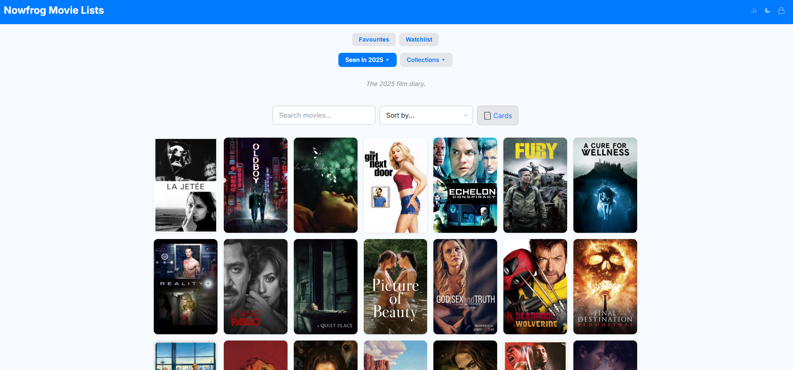
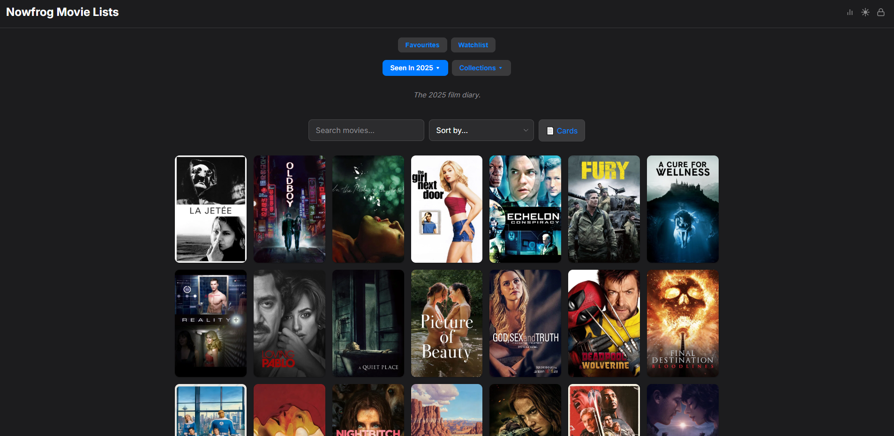
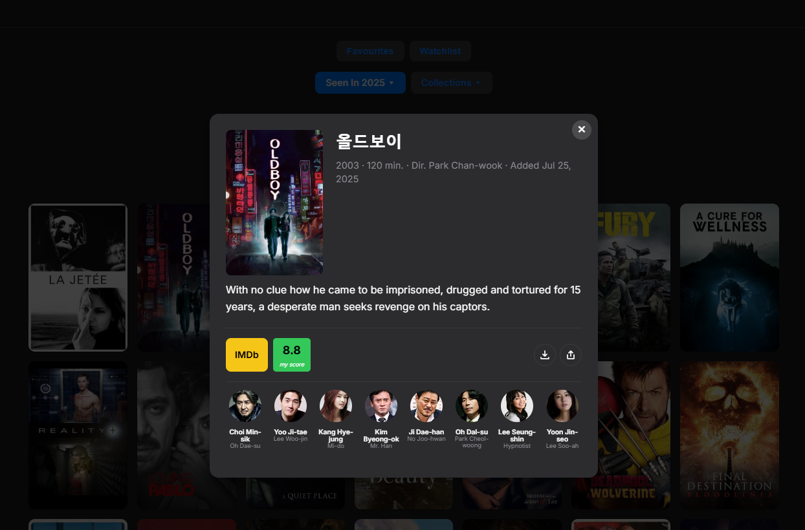

<p align="center">
  
</p>

<h1 align="center">NowMovies</h1>
<p align="center"><strong>Your personal movie tracker.</strong></p>
<p align="center">
  A self-hosted web app to track every movie you watch, rate them, organize into lists, and explore your cinema stats. Zero database — runs on any PHP hosting.
</p>

<p align="center">
  
  
  
  
  
  <a href="https://paypal.me/nowfrog">
    
  </a>
</p>

<p align="center">
  <a href="https://nowfrog.com/nowmovies/"><strong>Live Demo</strong></a> · <a href="#features"><strong>Features</strong></a> · <a href="#getting-started"><strong>Getting Started</strong></a> · <a href="#screenshots"><strong>Screenshots</strong></a> · <a href="#support-the-project"><strong>Donate</strong></a>
</p>


## Overview

NowMovies is a lightweight, self-hosted movie tracking app. Search any movie via TMDB, add it to custom lists, rate it, attach screenshots, and explore beautiful stats about your viewing habits. Everything is stored as JSON files — no MySQL, no database setup, just upload to any PHP hosting and go.

Installable as a **Progressive Web App (PWA)** on mobile and desktop.


## Features

### Movie Lists
- **Custom lists** with colors and descriptions (Favourites, Watchlist, Seen, or anything you want)
- **Favourites** and **Watchlist** are protected and always pinned at the top
- **Dropdown navigation** — Watched lists and Collections neatly organized
- **Cross-list tags** — see which other lists a movie belongs to

### Movie Details
- **TMDB integration** — search by title, get poster, overview, cast, director, runtime, genres
- **Personal ratings** synced across all lists
- **Screenshots** — attach and manage screenshots for any movie
- **Cast with photos** — scrollable cast section with actor photos and character names
- **Director info** displayed on cards and in search

### Stats Page (Wrapped-style)
- **Animated hero** with counter
- **Insight cards** — avg rating, total runtime (switchable hours/days/months/years), top genre, top country
- **Dynamic phrases** — personalized fun facts based on your data
- **Charts** — rating distribution, genres (donut), decades, countries
- **Top directors and actors** with profile photos
- **Top rated and lowest rated** movies with posters
- **Per-list stats** with adapted language (watched vs. collection vs. watchlist)

### Admin Panel
- **Lock icon** in header — click to login with your password
- **Manage Lists** button appears after login
- **Add/remove movies**, create/delete lists, manage screenshots, edit descriptions
- **Search TMDB** with live results dropdown
- **Auto-fill ratings** when adding a movie that exists in another list
- **Move from Watchlist** — eye button to move a movie to another list with rating prompt

### Design
- **Light and dark mode** with SVG icons
- **Header tints** — title bar color changes to match the selected list
- **No pinch-to-zoom**, hidden scrollbars — clean mobile experience
- **Responsive** — works on desktop, tablet, and phone
- **PWA installable** — add to home screen on any device

### Technical
- **Zero database** — all data stored as JSON files
- **PHP backend** — single `update_list.php` handles everything
- **Vanilla JS** — no frameworks, no build step
- **TMDB API** — free, only needs an API key
- **Bcrypt passwords** — admin password is securely hashed
- **Setup wizard** — configure on first visit, no manual file editing


## Getting Started

### Requirements

- Any web hosting with **PHP 7.4+** (shared hosting works fine)
- A free **TMDB API key** ([get one here](https://www.themoviedb.org/settings/api))

### Installation

1. **Download** or clone this repository:
   ```bash
   git clone https://github.com/nowfrog/nowmovies.git
   ```

2. **Upload** the folder to your web hosting (e.g., into `public_html/nowmovies/`)

3. **Visit** `https://yoursite.com/nowmovies/admin/setup.php` in your browser

4. **Enter** your TMDB API key and choose an admin password

5. **Done!** Visit `https://yoursite.com/nowmovies/` and start tracking movies

### Manual Configuration (alternative)

If you prefer not to use the setup wizard:

1. Copy `admin/config.example.php` to `admin/config.php`
2. Add your TMDB API key
3. Generate a password hash:
   ```bash
   php -r "echo password_hash('yourpassword', PASSWORD_BCRYPT);"
   ```
4. Paste the hash into `config.php`
5. Create `liste/manifest.json` from `liste/manifest.example.json`
6. Create empty JSON files for your lists (e.g., `liste/favourites.json` containing `{}`)


## Project Structure

```
nowmovies/
├── admin/
│   ├── setup.php           # First-time setup wizard
│   ├── config.php          # Your config (gitignored)
│   ├── config.example.php  # Template
│   └── update_list.php     # API backend
├── liste/
│   ├── manifest.json       # List definitions (gitignored)
│   └── *.json              # Movie data per list (gitignored)
├── screenshots/            # Movie screenshots (gitignored)
├── index.html              # Main app
├── scripts.js              # App logic
├── styles.css              # Styles
├── stats.html              # Stats page
├── site.webmanifest        # PWA manifest
└── favicon-*.png           # Icons
```


## Screenshots

<p align="center">
  
</p>
<p align="center"><em>Light mode — browsing a movie list with colored header tint</em></p>

<p align="center">
  
</p>
<p align="center"><em>Dark mode — same list, automatic theme switching</em></p>

<p align="center">
  
</p>
<p align="center"><em>Movie modal — details, cast with photos, rating, IMDb link, download & share</em></p>


## Tech Stack

| Technology | Purpose |
|-----------|---------|
| Vanilla JS | Frontend — no frameworks, no build step |
| PHP | Backend API — single file handles all operations |
| JSON files | Data storage — no database required |
| [TMDB API](https://www.themoviedb.org/) | Movie data, posters, cast, directors |
| [Chart.js](https://www.chartjs.org/) | Stats page charts |
| CSS Variables | Theming (light/dark mode) |


## Contributing

Contributions are welcome! Feel free to:

- 🐛 [Report bugs](https://github.com/nowfrog/nowmovies/issues)
- 💡 [Request features](https://github.com/nowfrog/nowmovies/issues)
- 🔧 Submit pull requests


## Support the Project

NowMovies is free and open-source. If you enjoy using it, consider supporting development:

<p align="center">
  <a href="https://paypal.me/nowfrog">
    
  </a>
</p>


## License

[MIT](LICENSE). Free to use, modify, and distribute.

<p align="center">
  Made with 🐸 by <a href="https://github.com/nowfrog">nowfrog</a>
</p>
